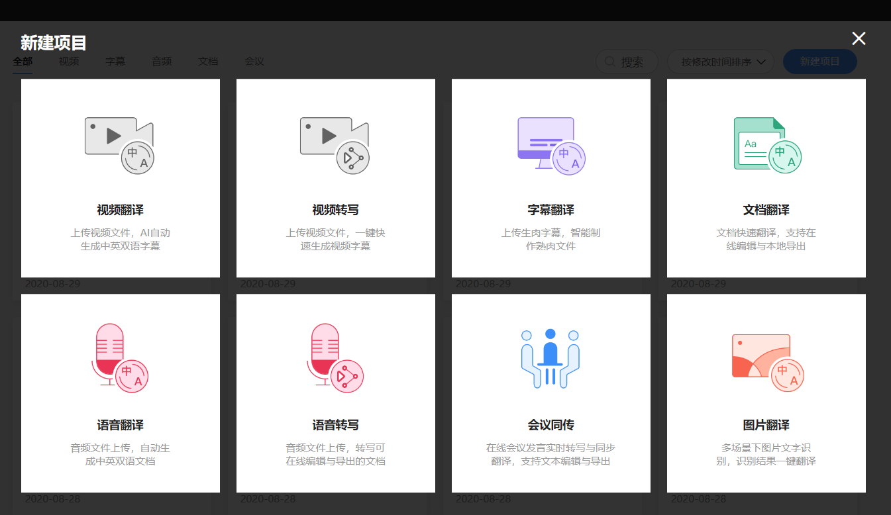
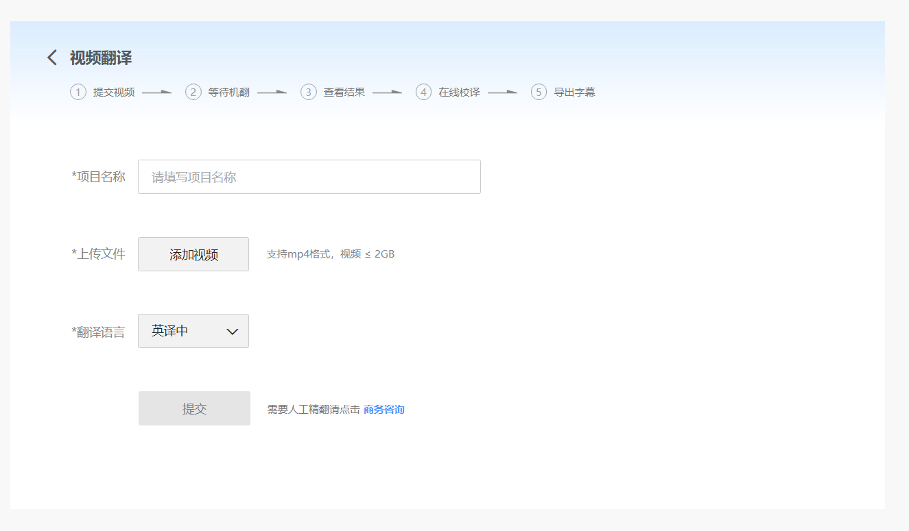
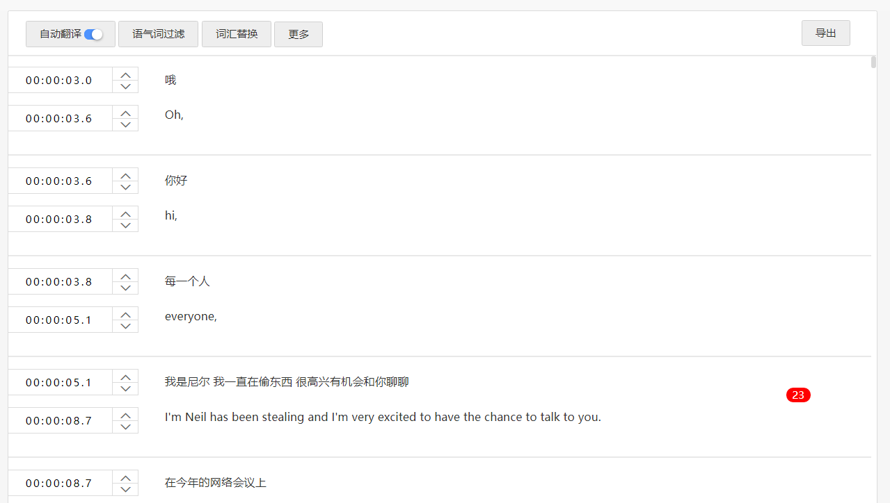
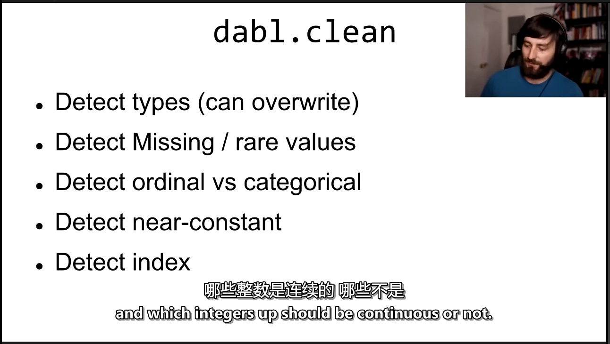

[影音视频工具软件](https://www.yuv420.com/tools/)

## 视频下载和字幕制作

B站视频下载：

```bash
you-get --format=dash-flv720 -o /Users/用户名/Vedio --playlist 网址URL
#选择的视频格式为dash-flv720，保存的文件夹位置/Users/用户名/Vedio
```

### 视频下载

1. 安装[you-get](https://github.com/soimort/you-get/wiki/%E4%B8%AD%E6%96%87%E8%AF%B4%E6%98%8E)

   以下为必要依赖，需要单独安装，除非于Windows下使用预包装包：

   - [python3](https://www.python.org/downloads/)
   - [FFmpeg](https://www.ffmpeg.org/)

   ```
   $ pip3 install you-get
   ```

   you-get进行升级

   ```
   $ pip3 install --upgrade you-get
   ```

   ffmpeg的bin文件放置system32目录下即可，或者将其添加到系统环境变量。

2. 开始下载

   当观赏感兴趣之视频，您可以使用 `--info`/`-i` 以查看所有可用画质与格式：

   ```
   $ you-get -i 'https://www.youtube.com/watch?v=jNQXAC9IVRw'
   ```

   标有`DEFAULT` 为默认画质。如认同，可下载:

   ```
   $ you-get 'https://www.youtube.com/watch?v=jNQXAC9IVRw'
   ```

   (如YouTube视频带有字幕，将被一同下载，以SubRip格式保存.)

   或，如您希望其他格式(mp4)，请使用其他提示选项:

   ```
   $ you-get --itag=18 'https://www.youtube.com/watch?v=jNQXAC9IVRw'
   ```


3. 下载任何指定文件

   当然除了视频资源，如果我们给定一个文件url，它都可以帮我们下载。

   ```
   $ you-get https://stallman.org/rms.jpg
   ```

4. 自定义下载文件路径和名称

   使用--output-dir/-o参数可以指定文件保存的路径，使用--output-filename/-O参数来指定保存的文件名。例如：
   ```
   $ you-get -o ~/Videos -O zoo.webm 'https://www.youtube.com/watch?v=jNQXAC9IVRw'
   ```

5. 下载网站所有视频

   ```
   $ you-get --playlist 'https://www.youtube.com/watch?v=jNQXAC9IVRw'
   ```

   

6. 设置代理

   使用--http-proxy/-x 参数为you-get指定http代理，默认情况下you-get会使用系统代理。如果不希望you-get使用任何代理，可以使用--no-proxy 参数来禁用。

   ```
   $ you-get -x 127.0.0.1:8087 'https://www.youtube.com/watch?v=jNQXAC9IVRw'
   ```

7. 暂停与恢复下载

   可以使用Ctrl+C 暂停下载.   

   临时的`.download`文件将保存于输出目录。下次使用`you-get`传入相同参数时，下载将从上次继续开始. 如果下载已经完成 (临时的`.download` 扩展名消失), `you-get`将忽略下载.

   用`--force`/`-f`强行重下载. (**注意:** 将覆盖同名文件或临时文件!)

7. 观看视频

   使用 `--player`/`-p` 将视频喂进播放器, 例如 `mplayer` 或者 `vlc`,而不是下载:

   ```
   $ you-get -p vlc 'https://www.youtube.com/watch?v=jNQXAC9IVRw'
   ```

8. 支持网站

| 网站                       | URL                                                   | 视频? | 图像? | 音频? |
| -------------------------- | ----------------------------------------------------- | ----- | ----- | ----- |
| **YouTube**                | <https://www.youtube.com/>                            | ✓     |       |       |
| **Twitter**                | <https://twitter.com/>                                | ✓     | ✓     |       |
| VK                         | <http://vk.com/>                                      | ✓     |       |       |
| Vine                       | <https://vine.co/>                                    | ✓     |       |       |
| Vimeo                      | <https://vimeo.com/>                                  | ✓     |       |       |
| Vidto                      | <http://vidto.me/>                                    | ✓     |       |       |
| Veoh                       | <http://www.veoh.com/>                                | ✓     |       |       |
| **Tumblr**                 | <https://www.tumblr.com/>                             | ✓     | ✓     | ✓     |
| TED                        | <http://www.ted.com/>                                 | ✓     |       |       |
| SoundCloud                 | <https://soundcloud.com/>                             |       |       | ✓     |
| Pinterest                  | <https://www.pinterest.com/>                          |       | ✓     |       |
| MusicPlayOn                | <http://en.musicplayon.com/>                          | ✓     |       |       |
| MTV81                      | <http://www.mtv81.com/>                               | ✓     |       |       |
| Mixcloud                   | <https://www.mixcloud.com/>                           |       |       | ✓     |
| Metacafe                   | <http://www.metacafe.com/>                            | ✓     |       |       |
| Magisto                    | <http://www.magisto.com/>                             | ✓     |       |       |
| Khan Academy               | <https://www.khanacademy.org/>                        | ✓     |       |       |
| JPopsuki TV                | <http://www.jpopsuki.tv/>                             | ✓     |       |       |
| Internet Archive           | <https://archive.org/>                                | ✓     |       |       |
| **Instagram**              | <https://instagram.com/>                              | ✓     | ✓     |       |
| Heavy Music Archive        | <http://www.heavy-music.ru/>                          |       |       | ✓     |
| **Google+**                | <https://plus.google.com/>                            | ✓     | ✓     |       |
| Freesound                  | <http://www.freesound.org/>                           |       |       | ✓     |
| Flickr                     | <https://www.flickr.com/>                             | ✓     | ✓     |       |
| Facebook                   | <https://www.facebook.com/>                           | ✓     |       |       |
| eHow                       | <http://www.ehow.com/>                                | ✓     |       |       |
| Dailymotion                | <http://www.dailymotion.com/>                         | ✓     |       |       |
| CBS                        | <http://www.cbs.com/>                                 | ✓     |       |       |
| Bandcamp                   | <http://bandcamp.com/>                                |       |       | ✓     |
| AliveThai                  | <http://alive.in.th/>                                 | ✓     |       |       |
| interest.me                | <http://ch.interest.me/tvn>                           | ✓     |       |       |
| **755ナナゴーゴー**        | <http://7gogo.jp/>                                    | ✓     | ✓     |       |
| **niconicoニコニコ動画**   | <http://www.nicovideo.jp/>                            | ✓     |       |       |
| **163网易视频网易云音乐**  | <http://v.163.com/> <http://music.163.com/>           | ✓     |       | ✓     |
| 56网                       | <http://www.56.com/>                                  | ✓     |       |       |
| **AcFun**                  | <http://www.acfun.tv/>                                | ✓     |       |       |
| **Baidu百度贴吧**          | <http://tieba.baidu.com/>                             | ✓     | ✓     |       |
| 爆米花网                   | <http://www.baomihua.com/>                            | ✓     |       |       |
| **bilibili哔哩哔哩**       | <http://www.bilibili.com/>                            | ✓     |       |       |
| Dilidili                   | <http://www.dilidili.com/>                            | ✓     |       |       |
| 豆瓣                       | <http://www.douban.com/>                              |       |       | ✓     |
| 斗鱼                       | <http://www.douyutv.com/>                             | ✓     |       |       |
| 凤凰视频                   | <http://v.ifeng.com/>                                 | ✓     |       |       |
| 风行网                     | <http://www.fun.tv/>                                  | ✓     |       |       |
| iQIYI 爱奇艺               | <http://www.iqiyi.com/>                               | ✓     |       |       |
| 激动网                     | <http://www.joy.cn/>                                  | ✓     |       |       |
| 酷6网                      | <http://www.ku6.com/>                                 | ✓     |       |       |
| 酷狗音乐                   | <http://www.kugou.com/>                               |       |       | ✓     |
| 酷我音乐                   | <http://www.kuwo.cn/>                                 |       |       | ✓     |
| 乐视网                     | <http://www.letv.com/>                                | ✓     |       |       |
| 荔枝FM                     | <http://www.lizhi.fm/>                                |       |       | ✓     |
| 秒拍                       | <http://www.miaopai.com/>                             | ✓     |       |       |
| MioMio弹幕网               | <http://www.miomio.tv/>                               | ✓     |       |       |
| 痞客邦                     | <https://www.pixnet.net/>                             | ✓     |       |       |
| PPTV聚力                   | <http://www.pptv.com/>                                | ✓     |       |       |
| 齐鲁网                     | <http://v.iqilu.com/>                                 | ✓     |       |       |
| QQ 腾讯视频                | <http://v.qq.com/>                                    | ✓     |       |       |
| 阡陌视频                   | <http://qianmo.com/>                                  | ✓     |       |       |
| Sina 新浪视频 微博秒拍视频 | <http://video.sina.com.cn/> <http://video.weibo.com/> | ✓     |       |       |
| Sohu 搜狐视频              | <http://tv.sohu.com/>                                 | ✓     |       |       |
| 天天动听                   | <http://www.dongting.com/>                            |       |       | ✓     |
| **Tudou土豆**              | <http://www.tudou.com/>                               | ✓     |       |       |
| 虾米                       | <http://www.xiami.com/>                               |       |       | ✓     |
| 阳光卫视                   | <http://www.isuntv.com/>                              | ✓     |       |       |
| **音悦Tai**                | <http://www.yinyuetai.com/>                           | ✓     |       |       |
| **Youku优酷**              | <http://www.youku.com/>                               | ✓     |       |       |
| 战旗TV                     | <http://www.zhanqi.tv/lives>                          | ✓     |       |       |
| 央视网                     | <http://www.cntv.cn/>                                 | ✓     |       |       |

### 字幕制作

1. 登陆[网易见外工作台](https://jianwai.youdao.com)

   

   新建项目，点击视频翻译

   

   添加视频即可对英文视频进行英文字幕生成并翻译

   

   成功后导出即可。

2. 可以先用[格式工厂](http://www.pcgeshi.com/)进行转换，将视频转换成音频，再选择语音识别，效率会更高。

   **注意：**网易见外平台每天有2小时的视频和语音转换限制，如果不够可以注册两个网易账号，基本可以满足需求。

   翻译完成后如下，字幕很Nice。

   